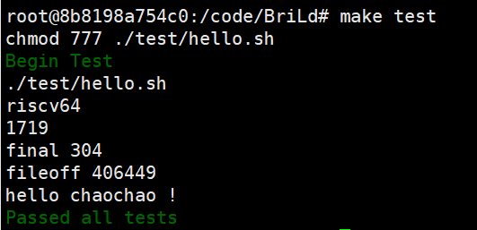
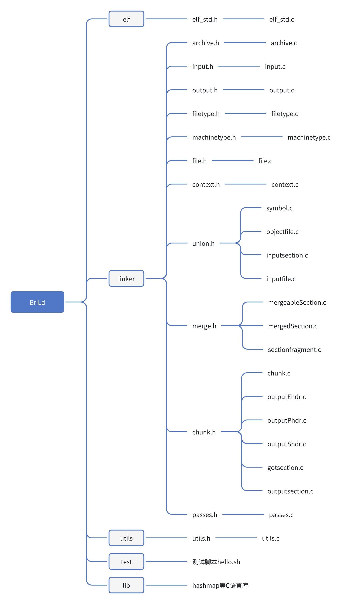
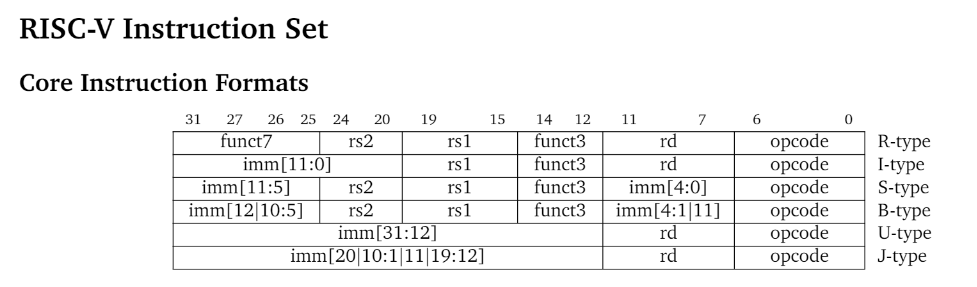
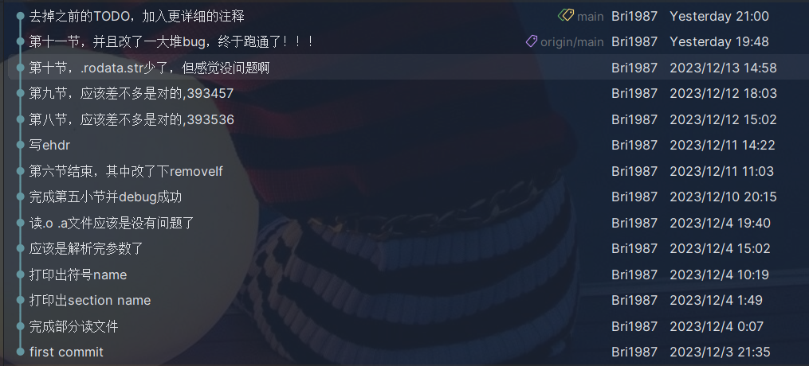
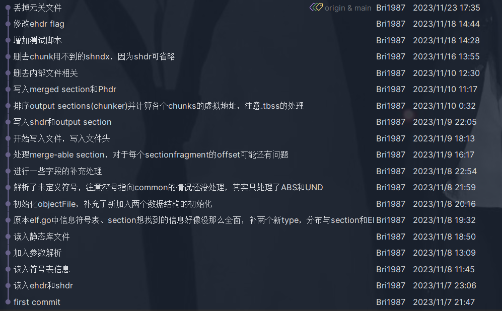
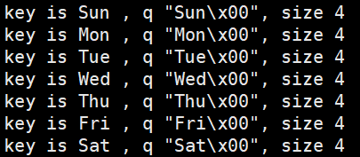
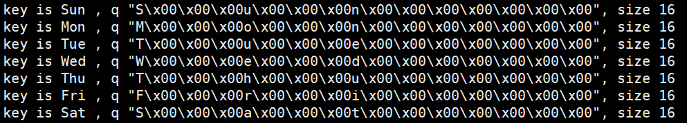

# RISCV 64位架构下的链接器

使用C语言实现一个静态链接器。

这个最终代码是学习中科院PLCT实验室推出的链接器课程完成，指路B站视频：

https://www.bilibili.com/video/BV1D8411j7fo/
并通过C语言重写。

顺道也学习了一点RISCV相关的知识。


目前TODO：

动态链接还完全没有处理，但感觉挺难的。

## 交叉编译环境配置

跟随课程配置了相同的docker环境

```bash
docker run -u root --volume ~/home/ubuntu/learning:/code -it golang:bullseye

apt update
apt install -y gcc-10-riscv64-linux-gnu qemu-user
ln -sf /usr/bin/riscv64-linux-gnu-gcc-10 /usr/bin/riscv64-linux-gnu-gcc
```


## 测试脚本说明

### 1. Makefile

```makefile
build:
	rm -rf cmake-build-debug
	mkdir cmake-build-debug
	cd cmake-build-debug && cmake ..
	make -C cmake-build-debug

test:
	chmod 777 ./test/hello.sh
	@printf '\e[32mBegin Test\e[0m\n'
	./test/hello.sh
	@printf '\e[32mPassed all tests\e[0m\n'

clean:
	rm -rf out/
	rm -rf ld

.PHONY: build clean test
```

首先使用`make build`构建，测试使用`make test`，即可运行./test目录下的`hello.sh`脚本。


### 2. hello.sh

```sh
#!/bin/bash

test_name=$(basename "$0" .sh)
t=out/tests/$test_name

mkdir -p "$t"

cat <<EOF | riscv64-linux-gnu-gcc -o "$t"/a.o -c -xc -
#include <stdio.h>

int main(void) {
    printf("hello chaochao !\n");
    return 0;
}
EOF

riscv64-linux-gnu-gcc -B./cmake-build-debug/ -static "$t"/a.o -o "$t"/out -O0
qemu-riscv64 "$t"/out
```

1. 首先列下测试程序：

   ```c
   #include <stdio.h>
   
   int main(void) {
       printf("hello chaochao !\n");
       return 0;
   }
   ```

2. 首先使用`riscv64-linux-gnu-gcc -o "$t"/a.o -c -xc -`生成`a.o`，其中：

   - `-c`：表示进行编译操作，而不进行链接操作
   - `xc`：指定源文件的语言类型。`-xc` 的含义是根据后续的文件扩展名自动推断源文件的语言类型。这里的 `c` 表示源文件是 C 语言代码。

3. 使用gcc进行下一步链接，即`riscv64-linux-gnu-gcc -B./cmake-build-debug/ -static "$t"/a.o -o "$t"/out -O0`，其中将使用的链接器替换成我们最终生成的可执行文件`-B./cmake-build-debug/`。可得到这个C语言测试用例的可执行文件out

4. 使用qemu模拟器执行out文件，`qemu-riscv64 "$t"/out`，得到结果：

   

   打印出了hello chaochao !（前面的为跑程序时打印的的其他辅助信息）

   链接成功！


## 项目结构



在主体部分linker中，union.h部分主要处理读入输入文件的内容，merge.h主要处理可以合并的段，chunk.h负责分几个部分，写入最终可执行文件。

## 整体思路及重要环节的步骤：

### 1. 初始读入ehdr, shdr和符号表信息

1. 读入ehdr ,shdr

   和汇编器一样，新建elf_std.h中录入elf的ehdr,shdr的各项信息

   其他具体就省略了。

   ```c
   // Elf32_Ehdr Executable header type. One per ELF file.
   typedef struct Ehdr_ {
       uint8_t Ident[16];      //表示ELF文件的标识信息
       uint16_t  Type;         //表示 ELF 文件的类型，比如可执行文件、共享库等
       uint16_t  Machine;
       uint32_t  Version;
       uint64_t  Entry ;       //表示程序的入口地址
       uint64_t  PhOff ;       //表示程序头表（Program Header Table）的偏移量
       uint64_t  ShOff ;       //表示节表（Section Header Table）的偏移量
       uint32_t  Flags ;       //表示 ELF 文件的标志信息
       uint16_t  EhSize;       //表示 ELF 文件头部的大小  sizeof(Elf32_Ehdr);
       uint16_t  PhEntSize ;   //表示program header table中每个表项的大小，每一个表项描述一个Segment信息
       uint16_t  PhNum ;       //表示program header table中表项的数量
       uint16_t  ShEntSize;    //Section header table中每个表项的大小sizeof(Elf32_Shdr)
       uint16_t  ShNum ;       //num sections
       uint16_t  ShStrndx ;    //表示节表中字符串表的索引，第多少个表项描述的是字符串表......
   }Ehdr;
   ```

   创建inputfile的struct，保存读取读取文件得到的信息

   ```c
   // InputFile 包含obj file或so file, 作为一个基类
   // 用于解析elf文件后存储信息用
   struct InputFile_{
       File *file;
       //ElfSyms 是一个 Sym 结构体的数组
       Shdr* ElfSections;
       int64_t sectionNum;
       //TODO 还没加完
   };
   ```

   在NewInputFile()中，根据ehdr,shdr等结构体大小，根据输入file的contents，对ehdr和shdr进行一个内容的填充

2. 新建objectFile结构体

   ```c
   struct ObjectFile_{
       InputFile *inputFile;    //这样表示继承
       Shdr *SymtabSec;
       //TODO
   };
   ```
   
   继承InputFile ，并通过symtabSec记录符号表的section header
   
   在InputFile中加入新信息：
   
   ```c
   // InputFile 包含obj file或so file, 作为一个基类
   // 用于解析elf文件后存储信息用
   struct InputFile_{
       File *file;
       //ElfSyms 是一个 Sym 结构体的数组
       Shdr* ElfSections;
       int64_t sectionNum;
   
       char* ShStrtab;
       int64_t FirstGlobal;
       Sym *ElfSyms;
       int64_t symNum;
       char* SymbolStrtab;
       
       //TODO
   };
   ```

   firstGlobal是第一个global变量在符号表中的索引，具体通过SymtabSec的info拿到值。

   ElfSyms是所有符号表项
   
   SymbolStrtab是表示存符号名字符串的字符表内容，通过符号表section header中的link字段代表索引
   
   这部分主要在ObjectFile的Parse()方法处理
   
   ```c
   o->SymtabSec = FindSection(o->inputFile,2);  //SHT_SYMTAB
       if(o->SymtabSec != NULL){
           o->inputFile->FirstGlobal = o->SymtabSec->Info;
           FillUpElfSyms(o->inputFile,o->SymtabSec);
           o->inputFile->SymbolStrtab = GetBytesFromIdx(o->inputFile,o->SymtabSec->Link);
       }
   ```
   
   


### 2. 参数解析

通过`riscv64-linux-gnu-gcc -B./cmake-build-debug/ -static "$t"/a.o -o "$t"/out -O0`命令会使用的测试参数 : 

```bash
["./ld", "-plugin", "/usr/lib/gcc-cross/riscv64-linux-gnu/10/liblto_plugin.so", "-plugin-opt=/usr/lib/gcc-cross/riscv64-linux-gnu/10/lto-wrapper", "-plugin-opt=-fresolution=/tmp/ccnH96wF.res", "-plugin-opt=-pass-through=-lgcc", "-plugin-opt=-pass-through=-lgcc_eh", "-plugin-opt=-pass-through=-lc", "--sysroot=/", "--build-id", "-hash-style=gnu", "--as-needed", "-melf64lriscv", "-static", "-z", "relro", "-o", "out/tests/hello/out", "/usr/lib/gcc-cross/riscv64-linux-gnu/10/../../../../riscv64-linux-gnu/lib/crt1.o", "/usr/lib/gcc-cross/riscv64-linux-gnu/10/crti.o", "/usr/lib/gcc-cross/riscv64-linux-gnu/10/crtbeginT.o", "-L.", "-L/usr/lib/gcc-cross/riscv64-linux-gnu/10", "-L/usr/lib/gcc-cross/riscv64-linux-gnu/10/../../../../riscv64-linux-gnu/lib", "-L/lib/riscv64-linux-gnu", "-L/usr/lib/riscv64-linux-gnu", "out/tests/hello/a.o", "--start-group", "-lgcc", "-lgcc_eh", "-lc", "--end-group", "/usr/lib/gcc-cross/riscv64-linux-gnu/10/crtend.o", "/usr/lib/gcc-cross/riscv64-linux-gnu/10/crtn.o"]
```

我们需要解析这些参数。


新建context.h记录参数信息

```c
typedef struct {
    char* Output;
    MachineType Emulation;
    char** LibraryPaths;
    int LibraryPathsCount;
} ContextArgs;

typedef struct {
    ContextArgs Args;
} Context;
```

读到-L将库文件目录放入``ctx.Args.LibraryPaths``中，并读到-l返回库文件名到remaining中，其中remaining是调用返回值`char **remaining = parseArgs(argc,argv,ctx);`在parseArgs函数中：遍历所有参数：

- `dashes`函数返回一个大小为3的数组，给每个参数变成原型，加-，加--三种类型，便于分析
- `readflag`函数处理`-static`这种，没有后续参数的
- `readArg`处理`-o out`这种有后续参数的


新建filetype.c标记file的类型，分出`.o`文件与`.a`静态库文件，方便后续处理

```c
typedef uint8_t FileType;

#define FileTypeUnknown ((FileType)0)
#define FileTypeEmpty   ((FileType)1)
#define FileTypeObject  ((FileType)2)
#define FileTypeArchive ((FileType)3)
```


### 3. 读入静态库文件

即主方法中的``ReadInputFiles(ctx,remaining);``

主要是将.a文件包含的.o文件们读出来，并存入ctx中

新建input.c进行处理，读入输入的文件，根据是.o还是.a分别处理：

1. 如果是.o文件的话，就按之前普通的处理：

   ```c
   ObjectFile *CreateObjectFile(Context *ctx,File* file,bool inLib){
       ObjectFile * objectFile = NewObjectFile(file,!inLib);
       Parse(ctx,objectFile);
       return objectFile;
   }
   ```

   其中主要是`Parse`函数进行处理。

2. 如果是.a文件，主要函数是archive.c中的``File** ReadArchiveMembers(File* file,int * fileCount)``：

   ```bash
   // ReadArchiveMembers 静态库可以被看作是一组目标文件（.o 或 .obj 文件）的组合
   // 读取并返回归档的静态文件中的所有目标文件
   // [!<arch>\n][Section ][Section ]......
   // [Section ] -> [ArHdr][                ][ArHdr][                ]
   ```

   - 跳过.a文件的文件头：``int pos = 8;``

   - 开始for循环遍历每个``[ArHdr][                ]``    ：

     - 拿到每个ArHdr Header：``Read(hdr,file->Contents+pos,sizeof(ArHdr));``

     - 阅读后面的内容：

       - 有2个特殊内容：

         - symtab : 
         - 一个archive通常只有一个strtab , strtab归档文件里面obj的名字。通过``hdr.IsStrtab()``判断并记录

       - 如果section既不是arch独有的symtab也不是strtab , 就是原来obj文件本身的内容，拿到.o文件

         ```c
         files = appendFile(files, newFile, fileCount);
         ```


   > 注意读取.a文件时，文件格式要求align 2，读取文件时``file->contents_len - pos > 1``即可停下，不需要大于0


### 一些辅助补充

原本elf_std.c中信息符号表、section想找到的信息，对于实现链接功能，好像并没那么全面，补两个新type，分别与section和Elf32_Sym是对应关系

1. 首先在context struct中加入SymbolMap ：记录下所有文件所有的符号项

   ```c
   typedef struct {
       ContextArgs Args;
   
       struct ObjectFile_** Objs;
       int ObjsCount;
   
       HashMap *SymbolMap;  //char*,Symbol*
   } Context;
   ```

2. 新建symbol struct：

   ```c
   typedef struct Symbol_{
       ObjectFile *file;
       char* name;
       uint64_t value;
       int32_t symIdx;
       
       InputSection * inputSection;
       //TODO
   }Symbol;
   ```

   与原先Elf32_Sym的区别：

   ```c
   typedef struct {
       uint32_t Name;          //存储一个指向字符串表的索引来表示对应符号的名称
       uint8_t Info;
       uint8_t Other;
       uint16_t Shndx;         //每个符号都有属于的节，当前成员存储的就是对应节的索引
       uint64_t Val;           //存储对应符号的取值，具体值依赖于上下文，可能是一个指针地址，立即数等
       uint64_t Size;
   } Sym;
   ```

   - 标记了符号属于的file
   - inputsection就是指向的section，就是原来的Shndx

   设计Symbol的原因是为了下一步符号解析，原先的ElfSyms存的是解析前的符号表项，Symbol的local表项和之前是一样的，但是Global表项的信息不同，进行了解析

3. 新建inputsection struct ：

   ```c
   struct InputSection_{
       struct ObjectFile_ *objectFile;     //来自于某个文件
       char* contents;
       uint32_t shndx;    //在section header数组中的下标值，为了找到它的section header信息
   };
   ```

   并在objectfile.go中加入：``InputSection ** Sections;``
   
   

### 4. 解析未定义符号

即主方法中的``ResolveSymbols_pass(ctx);``

1. inputSection初始化：objectfile.parse()的``InitializeSections(o,ctx);``

2. symbol初始化：objectfile.parse()的``InitializeSymbols(ctx,o);``

   - 初始化objectfile的inputfile的``Symbol* LocalSymbols;``，并将每个local symbol的File指向当前objectfile
   - 遍历local symbol，将每个local symbol的值与原来o.ElfSyms中的符号表项信息进行对应，将非绝对符号指向的section进行安置
   - 遍历填充：``o->inputFile->Symbols[i] = &o->inputFile->LocalSymbols[i];``
   - 填充其他非local的symbols，以默认初值填充，等待后续处理

3. objectfile的``ResolveSymbols()``方法：

   - localSymbol是不需要resolve的,从第一个全局符号开始解析

   - undef的肯定解析不到，这里就不处理了

   - 解析非local符号：

     ```c
     //读到不同文件时，会将每一个global符号应该在的文件赋到对应的file
     if(sym->file == NULL){
          sym->file = o;
          SetInputSection(sym,isec);
          sym->value = esym->Val;
          sym->symIdx = i;
     }
     ```

4. 在passes中再调用`MarkLiveObjects`，过滤掉不需要处理的文件。可见在未过滤之前有1719个文件，在过滤后减到了304个文件，是非常必要的。

   

   过滤方法：

   - 为InputFile加入字段`bool isAlive;`
   - 将直接就是.o的文件的isAlive标为true，由静态库.a分出的.o文件先都标成false
   - 工作表算法，将isAlive的文件的UND符号所指向的原文件标为isAlive（如果初始状态是false的话），直到每个isAlive文件的UND符号原指向文件都为true。其他isAlive标为false的文件从ctx->Objs中删除，不再处理。


### 5. 处理merge-able sections

 即主方法中的``RegisterSectionPieces(ctx);``

总思想：

将一个input section转化为包含多个section fragment的merge-able section，最后再放入merged section中

存在这种情况的，比如需要将"hello world","hi"这种字符串信息merge到一起：

output.c中：

```c
char* GetOutputName(char* name, uint64_t flags) {
    const char* prefixes_[] = {
            ".text.", ".data.rel.ro.", ".data.", ".rodata.", ".bss.rel.ro.", ".bss.",
            ".init_array.", ".fini_array.", ".tbss.", ".tdata.", ".gcc_except_table.",
            ".ctors.", ".dtors."
    };

    //merge-able section一定是readonly的
    if ((strcmp(name, ".rodata") == 0 || strncmp(name, ".rodata.", 8) == 0) && (flags & SHF_MERGE) != 0) {
        if ((flags & SHF_STRINGS) != 0) {
            return ".rodata.str";
        } else {
            return ".rodata.cst";
        }
    }

    //.text或者.text.1 .text.* , 返回.text
    //即都将这些section映射到.text
    //多对一的映射，即多个inputsection映射到一个outputsection中
    size_t prefixesCount = sizeof(prefixes_) / sizeof(prefixes_[0]);
    for (size_t i = 0; i < prefixesCount; i++) {
        //......

        if (prefixLength > 0) {
            prefixLength--;
            if (strcmp(name, stem) == 0 || strncmp(name, prefix, prefixLength) == 0) {
               // printf("_stem %s\n",stem);
                return stem;
            }
        }
    }
    return name;
}
```

结构体：

```c
//input section拆成一个(? y)包含多个sectionFragment的merge-able section , 再放入merged section
typedef struct MergeableSection{
    MergedSection * parent;
    uint8_t p2align;
    char** strs;            //fragments的原始数据, 是数据，不一定是字符串 , 还有const原始数据
    int strNum;
    int* strslen;
    uint32_t* fragOffsets;
    int fragOffsetNum;
    SectionFragment ** fragments;
    int fragmentNum;
}MergeableSection;
```

其中SectionFragment是以原数据为索引的数组，Chunk是写入最终文件的一个基本块，这个MergedSection进行一个继承

```c
//合并后的section
struct MergedSection_{
    Chunk *chunk;
};

typedef struct Chunk_{
    char* name;
    Shdr shdr;
    ChunkType chunkType;
    int32_t rank;

    struct {
        HashMap *map;    //string - sectionFragment
    }mergedSec;
    
    //TODO
}Chunk;
```

其中SectionFragment的结构体：

```c
//将merge-able section分成小的数据块
struct SectionFragment_ {
    MergedSection* OutputSection;   //进行一个双向关联吧
    uint32_t Offset;      //在section中的offset
    uint32_t P2Align;
    int strslen;		//保存这个sectionFragment的长度
} ;
```

其中，在Symbol结构中加入，一个符号要么是input section中的，要么这个input section被转化为merge-able section了，这个符号属于一个SectionFragment

```c
//union
InputSection * inputSection;
SectionFragment *sectionFragment;
```


在ObjectFile中添加``MergeableSection **mergeableSections;``

1. 初始化：``InitializeMergeableSections(o,ctx);``

   - 判断flags位中的SHF_MERGE位是否为1，决定是否splitSection，在将这个Section split后，将这个section的isAlive设为false，从此只需注意它最后merge后的section，这个section不必再单独处理了

   - splitSection：

     新建一个MergeableSection，并通过``GetMergedSectionInstance``单例模式创造或得到这个mergeableSection最终映射对应的MergedSection

     - 如果这个要被split的section的SHF_STRINGS位是1，是strs数据，每项数据大小不固定，将这个数据大小的值保存到strslen数组对应的下标中，具体原因在坑点部分会详细讲到，并将每个数据放入MergeableSection中的Strs中
     - SHF_STRINGS位不是1，是const数据，每个数据固定是EntSize大小，将每个数据放入MergeableSection中的Strs中

   > 注意：显然不是每个section都是merge-able section，但是我们的i是与原来section的下标一一对应的，这是为了通过section的index直接找到它转化后的merge-able section

2. ``ObjectFile中的RegisterSectionPieces``方法：

   - 遍历初始化得到的全部MergeableSections，将这个merge-able section的每一项Strs建立一个SectionFragment，并将这个section fragment加入对应的merged section和这个merge-able section的SectionFragment项中

   - 遍历所有符号表项，对于每一个有指向section的符号表项，如果指向的section是一个mergeableSection了

     每个指向merge-able section的符号表项的value值就是一个在原section信息中的偏移吧（因为具体值内容就是section内容，section内容就是一个个原数据，偏移指向比如原数据的起始？），根据这个原数据索引拿到这个符号表项对应的sectionfragment。将这个符号表项的sectionfragment进行一个设置，并将inputSection设为NULL。

     将sym.Value设为这个包含原数据的sectionFragment的偏移值


sectionfragment.go的getFragment和mergedsection.go的insert感觉对偏移的处理还没处理，在part 8解决


### 6. 写入新的可执行文件(ehdr , shdr, section)

在context结构体中添加

```c
struct Chunk_ **chunk;
int chunkNum;
char* buf;

//链接器自己生成了
struct OutputEhdr_* ehdr;
struct OutputShdr_* shdr;
struct OutputSection_** outputSections;
int outputSecNum;
```

新建outputsection结构体，其中它在chunk的特殊部分是：

```c
struct {
        struct InputSection_** members;
        int memberNum;
        uint32_t idx;
    }outpuSec;
```

并在inputsection的初始化NewInputSection()中通过单例模式赋值inputsection对应的outputsection：

``inputSection->outputSection = GetOutputSection(ctx,name,shdr->Type,shdr->Flags);``

在chunker.h中添加接口，安置一些每个chunk块都需实现的方法：

```c
Chunk *NewChunk();
void CopyBuf(Chunk* c,Context* ctx);
void Update(Chunk* c,Context* ctx);
```


1. 主方法：首先``CreateSyntheticSections(ctx);``创建自己合成的section，目前是ehdr和shdr，目前先是默认值，放入ctx的Ehdr和Shdr中，并加入chunk

2. 主方法：``BinSections(ctx);``填充output section里面的由input section组成的members数组

3. 主方法中调用``CollectOutputSections(ctx);``，将ctx的outputSections和merged sections放入chunks中；再调用``ComputeSectionSizes``计算每个output section中的input section们的offset（因为output section和input section是一对多的关系）

4. 对每个chunk进行updateShdr：

   虽然是遍历，但是只有OutputShdr实现了这个方法，只有它需要更新。它根据后面chunks的数量，将需要的section header的chunk（大部分chunk基本可以看作section了）数量计算出来，算出section header table需要占用的大小

5. 主方法中调用：``uint64_t fileoff = SetOutputSectionOffsets(ctx);``，遍历ctx的所有chunks，完成每个chunk起始的offset的初始化，并计算出可执行文件总大小，为ctx->buf分配fileoff大的空间。

   具体section 顺序见下节补充

6. 对每个chunk使用copyBuf赋值，其中outputEhdr, outputShdr, outputSection都自己对copyBuf进行了实现。其中shdr这里就简单处理了，因为最终可执行文件没有section header也能跑。调用各个chunk的copybuf方法：

   ```c
   void CopyBuf(Chunk* c,Context* ctx){
       if(c->chunkType == ChunkTypeEhdr)
           Ehdr_CopyBuf(c,ctx);
       else if(c->chunkType == ChunkTypeShdr)
           Shdr_CopyBuf(c,ctx);
       else if(c->chunkType == ChunkTypeOutputSection)
           OutputSec_CopyBuf(c,ctx);
       //TODO
   }
   ```

   


### 7. 写入可执行文件（为output section排序，计算对应的虚拟地址）

1. 为output section（即chunk了）排序：在``ComputeSectionSizes(ctx);``之后调用`SortOutputSections(ctx);`：

   给每个chunker一个rank值，值越小排在越前面

   ```c
   // SortOutputSections 给output section排序，尽量让可以合为一个segment的section连在一起
   // 基本顺序 :
   // EHDR     //rank 0
   // PHDR     //rank 1
   // .note sections
   // alloc sections
   // non-alloc sections : 不会参与最终可执行文件的执行 , 也放在后面 max int32 -1
   // SHDR     //max int32
   ```

2. 计算虚拟地址：

   对``SetOutputSectionOffsets(ctx);``进行补充：

   先排alloc sections的虚拟地址，再排non-alloc的

   （单位都是chunker，merged section也是alloc吧（这里对merged section的话，首先它也是chunker，在这里也会被处理；然后能被merge的section的flag type都是一致的，在merged section的Shdr中也是保存了的）


### 8. 写入merged section和phdr

1. 在mergedsection在加入``void AssignOffsets(MergedSection* m);``：

   - 首先根据p2align和原始数据strslen的长度对所有碎片进行排序
   - 从offset 0开始计算索引section fragment的偏移值

   这个方法在`ComputeMergedSectionSize`中调用，并安置在之前处理merge-able section里面后面：

   ```c
   RegisterSectionPieces(ctx);
   ComputeMergedSectionSizes(ctx);
   CreateSyntheticSections(ctx);
   ```

2. 将chunks分类划入phdr，在`void Phdr_UpdateShdr(Chunk* c,Context* ctx)`中：

   - 第一个默认为NULL的Phdr：

     ``Phdr *phdr = define(PT_PHDR,PF_R,8,ctx->phdr->chunk);``

   - 把所有note chunk push到一个Phdr里

   - 把所有bss的放在一起，不是bss的放在一起

   - 单独处理tbss

目前由于第一次统一对chunk的updateShdr在定偏移前面，所有phdr的vaddr这些全是0（所以后面sort完补了一次更新）


### 9. 重定向

首先在outputfile.go中跳过.eh_frame，就不处理异常了，并加这个加入parse()初始化，即`SkipEhframeSections(o);`

由于riscv只有rela而没有rel的重定向类型，只处理rela（即都包含addend）

```c
typedef struct {
    uint64_t Offset;
    uint32_t Type;
    uint32_t Sym;
    int64_t Addend;
} Rela;
```


1. 在inputsection结构体中加入重定位部分：

   ```c
   //重定向
   uint32_t RelsecIdx;
   Rela* rels;
   int relNum;
   ```

2. 在objectfile.c中的InitializeSections中加入对重定向的初始化：

   将每个重定向target指向的目标文件section赋值：

   ```c
   //处理重定向的section
       for(int i=0; i< o->inputFile->sectionNum;i++){
           Shdr *shdr = &o->inputFile->ElfSections[i];
           if(shdr->Type != SHT_RELA)
               continue;
           
           assert(shdr->Info < o->isecNum);
           InputSection *target = o->Sections[shdr->Info];
           if(target != NULL){
               //没有两个relocation指向同一个section的情况
               assert(target->RelsecIdx == UINT32_MAX);
               target->RelsecIdx = i;
           }
       }
   ```

3. 添加gotsection的chunk结构体，其中特殊部分有：

   ```c
   struct {
           Symbol ** GotTpSyms;
           int TpSymNum;
       }gotSec;
   ```

   虽然本链接器不处理动态链接，但是仍添加这个结构体的原因是：thread local storage TLS段也会把数据存到.got , l而ibC中这种情况很多。

   再增加一个.got表中条目的结构体：

   ```c
   // .got 表中的每个条目对应一个全局变量或函数的地址 , 针对tp_addr的偏移量
   typedef struct GotEntry_{
       int64_t idx;
       uint64_t val;
   }GotEntry;
   ```

4. 在主方法中添加`ScanRelocations(ctx);`，遍历文件，将inputsection的重定向项读取添加到对应文件。对于属于.got表的symbol，调用`void AddGotTpSymbol(Chunk* chunk, Symbol* sym)`，向GotTpSyms中增加一个元素。

5. 在扫描完所有重定向表项后，即可开始处理重定向。首先根据RISCV的体系结构要求加入一些辅助函数，参考RISCV文档链接：

   https://github.com/jameslzhu/riscv-card/blob/master/riscv-card.pdf

   

   根据RISCV指令类型，需要写不同的辅助函数填写重定位表项，于是有了

   ```c
   uint32_t jtype(uint32_t val){
       return Bit_32(val,20) << 31 | Bits_32(val,10,1) << 21 |
               Bit_32(val,11) << 20 | Bits_32(val,19,12) << 12;
   }
   
   void writeItype(void* loc, uint32_t val) {
       uint32_t mask = 0b00000000000011111111111111111111;
       uint32_t v ;
       Read(&v,loc,sizeof (uint32_t));
       v = (v & mask) | itype(val);
       Write(loc,sizeof (uint32_t),&v);
   }
   ```

   等等一些函数。

6. 在outputSection的CopyBuf中的WriteTo里添加重定向处理`ApplyRelocAlloc(i,ctx,buf);`，遍历所有重定向项，将原来不确定的0进行填充，根据每个项的rel.Type分别进行处理，具体此处略。

   ```c
   switch (rel.Type) {
               case 1/*R_RISCV_32*/:
                   //...
               case 2/*R_RISCV_64*/:
                   //...
               case 16/*R_RISCV_BRANCH*/:
                   //...
               case 17/*R_RISCV_JAL*/:
                   //...
               case 18/*R_RISCV_CALL*/:
               case 19/*R_RISCV_CALL_PLT*/:
                   //...
               case 21/*R_RISCV_TLS_GOT_HI20*/:
                   //...
               case 23/*R_RISCV_PCREL_HI20*/:
                   //...
               case 26/*R_RISCV_HI20*/:
                   //...
               case 27/*R_RISCV_LO12_I*/:
               case 28/*R_RISCV_LO12_S*/:
                   //...
               case 30/*R_RISCV_TPREL_LO12_I*/:
               case 31/*R_RISCV_TPREL_LO12_S*/:
                   //...
               default:
                   //printf("other !\n");
                   break;
           }
   ```

   


## 心得体会

写这个链接器的难度远比我想象中高，可能是因为使用了`riscv64-linux-gnu-gcc -B./cmake-build-debug/ -static "$t"/a.o -o "$t"/out -O0`来测试的原因，要分析的库文件和要处理的情况特别多。在过滤前要处理1719个文件，3800多个符号项，即使在过滤后也要处理304个文件。但即便是如此，也还有非常多还没有实现的内容，比如这里支持的重定向类型还十分有限，还有一些符号冲突是没有处理的，这也就导致了目前这个链接器只能在这个虚拟的docker环境下运行，更进一步放到更复杂的环境下目前还跑不了。

整个教学视频看了两遍多，收获还是非常大的，比较体系地学习到了链接器的写法，在学习重写的过程中，也向课程提出了修改issue并被采纳，是令我很高兴的。在具体用C语言重写的时候，还是遇到了一些很折磨的bug，比如下面commits里面第十节的.rodata.str数量没对等等，有很多Bug处理得很痛苦，所以终于跑通的时候，真的长舒一口气。



其实在11月的时候也尝试用go语言完成一个arm32位的链接器，但由于在重定位的处理不是特别妥当，也有一些我至今还没能发现的Bug，导致最终生成的可执行文件只能readelf打印，内容看上去也都对，却始终无法运行，十分遗憾，希望以后有时间能将这部分补上。




### 坑点

具体讲一点点坑点吧，由于PCLT的课程其实已经写得很详细了，这里就只简单讲述C语言主要会遇到的一个问题。由于我对文件内容是通过char* 类型来保存的，而字符串类型读到'\0'就会停止，但ELF文件显然是有很多'\0'的，很多地方必须谨慎处理，要用memcpy，不能strcpy。

并且，在之前提到的.rodata.str数据处理上部分丢失，这是卡我最久的问题，最初在mergedSection的sectionFragment的哈希表中，我使用了char*作为键key，直接存储，导致了下面两张图片中的sectionFragment没有区分开，因为char *都是一样的，但存储的对齐方式却不同，最初直接打印键key甚至很久都没有发现问题，直到打印出字节才发现，后来对hashMapContain的规则加以修改，才得以解决。





